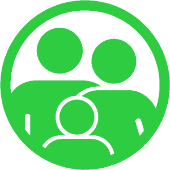

Title: ¿Quienes somos?
Slug: quienes-somos
Lang: es
sortorder: 2
Intro: Somos un grupo sin organización jerárquica y descentralizado, y nuestro afán es el Software Libre. Somos, mayormente, estudiantes y/o profesionales informáticos, otros simplemente comparten la filosofía del Software Libre.  También, la mayoría somos de Paraná, pero hay integrantes de Oro Verde, Santa Fé, y otras localidades aledañas. ¿Querés conocernos mejor?

